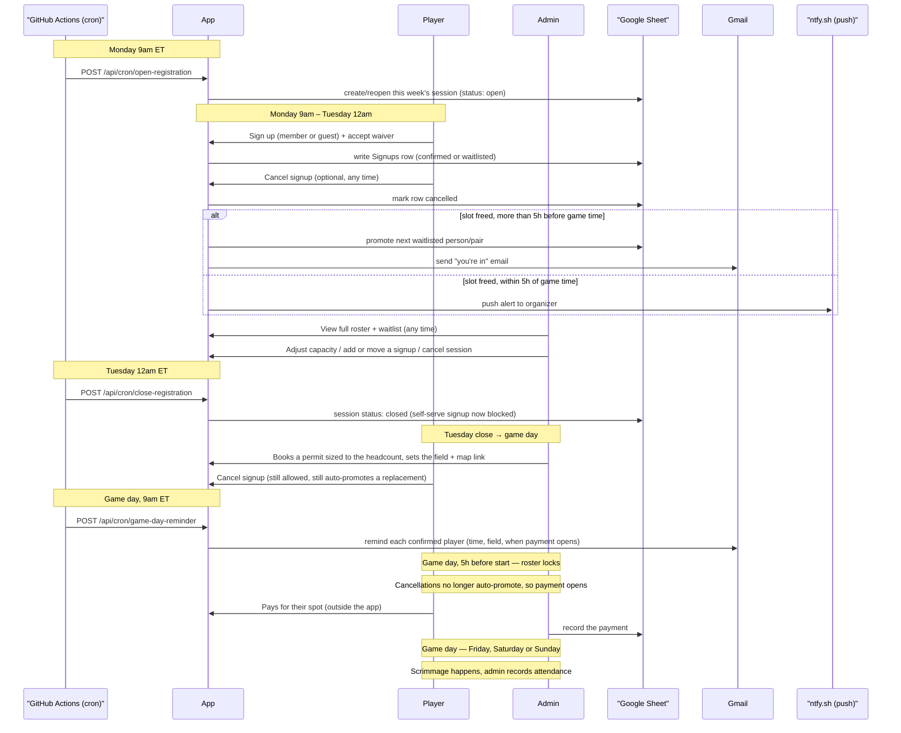

# Weekly Softball Scrimmage

The signup app for New Hope Fellowship's weekly pickup softball game.
Members and their guests sign in with Google, sign up for a spot
(first-come first-served with an automatic waitlist), see whether
they're confirmed or waitlisted, and cancel if plans change — with
promotions and organizer alerts handled automatically. A Next.js app
backed by a Google Sheet as its database.

## How it fits together

- **Next.js app** (`src/app`) — the signup UI, the admin dashboard, and
  every API route. Deployed on Vercel.
- **Google Sheet** (`src/sheets`) — the database. Five tabs: `Sessions`
  (one row per week's game, including how many fields are booked and
  whether teams have been posted), `Signups` (including which team each
  player is on), `Players` (saved profiles), `Admins` (allowlist of admin
  emails), and `Feedback` (append-only log of bug reports and
  suggestions). Read and written via a service
  account through the Sheets API, not a spreadsheet UI a player ever
  touches directly. Columns are mapped **by position**, so the header
  arrays in `src/sheets/schema.ts` are the physical layout — run
  `npm run verify:schema` after any change to either.
- **Google OAuth** (`next-auth`) — player identity. A signed-in Google
  account's email is the identity used everywhere (no separate
  username/password).
- **Gmail API** — sends the app's automated emails: "you moved up from
  the waitlist", sub-request notifications, and a game-day reminder.
  Authorized once against a dedicated Gmail account
  (`scripts/authorizeGmailSender.ts`), not per player — and with
  send-only permission, so the app cannot read anyone's mail.
- **ntfy.sh** — push notifications to the organizer: a cancellation too
  close to game time to auto-promote anyone, and a heads-up whenever
  someone files feedback from the site's feedback button.
- **GitHub Actions** (`.github/workflows`) — four scheduled jobs:
  opening registration Monday, closing it Tuesday, the game-day
  reminder, and team generation. The first three fire at fixed clock
  times; team generation runs hourly on game days, because the moment it
  cares about (the roster lock) moves with each session's game time.

## Typical week



### As a player

1. **Monday, 9am ET** — registration opens automatically for that
   week's game. No action needed to make this happen; it's just
   when the app starts accepting signups.
2. **Sign up any time before Tuesday 12am ET (midnight).** First-time
   players fill out a short profile (name, gender, positions) once
   — after that it's remembered. Every signup requires accepting the
   waiver, every time. You can sign up for yourself, or bring a guest
   (who answers two extra questions: who invited them, and whether
   they're willing to share a slot with that member rather than take a
   separate spot). Sharing is a *request*: the guest gets their own place
   in the queue like anyone else, and if they're waitlisted the member
   they named is asked to accept. Naming a member never takes their spot,
   moves them, or changes what they owe — names are typed by hand and
   can't stand in for consent. This window is intentionally short — it gives the
   organizer the rest of the week to book a permit sized to the actual
   headcount.
3. **You're told immediately** whether you're confirmed or on the
   waitlist, based on the week's capacity — and if waitlisted, where you
   are in the queue. Once you're signed up you can also see who else is
   playing; before that you only see the headcount.
4. **Cancel any time** if plans change — from right after you sign up
   through game day itself. If your cancellation frees up a confirmed
   spot:
   - More than 5 hours before game time: the next person (or pair) on
     the waitlist is automatically promoted and emailed. No money has
     changed hands at this point, so there's nothing to settle.
   - Within 5 hours of game time: no one is auto-promoted (too last
     minute for an email to reach anyone in time) — the organizer gets a
     push alert instead so they can personally text someone.
5. **Tuesday, 12am ET** — registration closes automatically. You can no
   longer sign up fresh for that week, but you can still cancel an
   existing signup.
6. **Where you're playing** is confirmed during the week. The general
   area is known up front ("Mississauga — specific field TBD"); the
   exact field is booked once the headcount is known and then appears on
   the homepage with a map link.
7. **Game day morning** — confirmed players get a reminder email with
   the time, the field, and when payment opens, and can add the game to
   their calendar from the homepage. Game day is Friday by default; an
   admin can schedule or move it to Saturday or Sunday.
8. **Five hours before the game, the roster locks and payment opens.**
   Each spot has a fixed price, shown up front and unchanged by how many
   people end up playing (two people sharing a spot pay half each). Pay
   any time between the lock and the start of the game; payment happens
   outside the app.

   The lock and the payment window are deliberately the same moment. It
   is also when cancellations stop auto-promoting anyone — so nobody who
   has paid can subsequently be replaced. That means there are never
   refunds to issue or transfers between players to work out. Cancelling
   after the lock doesn't remove what you owe, because no one takes your
   place and the field is booked either way.

9. **Teams go up on the homepage** once the organizer posts them. They
   are drawn up automatically after the roster locks and reviewed before
   anyone sees them, so they appear some time between the lock and the
   game. If someone cancels after that, they simply drop off their team
   and it plays a person short.

### As an admin

Anyone whose email is on the `Admins` sheet tab sees an admin dashboard
in addition to the regular player view. Across the same week:

- **View the full roster and waitlist** at any time — unlike the
  player-facing view, this shows every signup regardless of status
  (including cancelled ones), for the complete picture.
- **Adjust that week's capacity and price per spot**, **reschedule** it
  (including to a different day or week — existing signups follow), or
  **cancel the whole session** (e.g. a rainout). Cancelling doesn't
  bulk-cancel existing signups, so there's a record of who would've
  played if it gets rescheduled.
- **Open or close registration by hand.** New sessions are created
  **closed** so a future week can't be signed up for early; the Monday
  cron opens whichever session belongs to the current week.
- **Set the location in two stages** — the general area when the week is
  created, then the specific field and a map link once the permit is
  actually booked.
- **Manually add a signup** on someone's behalf — same member/guest
  logic and capacity accounting a player's own signup goes through, for
  someone who texted the organizer directly instead of using the app.
- **Manually move someone's status** (confirmed / waitlisted /
  cancelled) or remove a signup entirely — a direct override that
  deliberately skips the automatic promotion/email side effects, since a
  manual admin action already is the explicit decision.
- Gets the **late-cancellation push alert** described above whenever
  anyone cancels within 5 hours of game time.
- Gets an **open-spots push alert** the moment registration closes
  Tuesday if the session still has room under capacity — a nudge to
  manually add someone rather than book a permit for an empty spot.
- **Reads bug reports and feedback** on the `Feedback` tab. A signed-in
  player uses the feedback button in the site footer; the report lands as
  a row with the time it was submitted, which kind it is, who sent it,
  their message, and the page they were on.

  The organizer also gets a **push** saying a report arrived and from
  whom, which opens the spreadsheet when tapped. Deliberately it does
  *not* repeat the message: a notification is easy to swipe away and
  impossible to search later, so the row is the record and the push is
  only a nudge to go read it. Sent at normal priority, unlike the two
  alerts above, so a 2am suggestion doesn't ring like an emergency.

  Capped at five reports per person per hour, and it costs one Sheets
  write and no reads, so a burst of feedback can't eat into the read
  quota signups depend on.
- **Track payments.** Ticking someone as paid records what they paid and
  when, and the session card shows collected vs expected vs the permit
  cost, so over- or under-collection is visible rather than implicit.
- **Track attendance.** A per-signup checkbox for who actually turned
  up. Admin-only — nothing is shown to players and nothing happens
  automatically; it's just a record.
- Gets a **headcount push the moment registration closes**, whatever the
  numbers are. The open-spots alert above stays quiet when the session
  filled, which is exactly when a second field is worth considering, so
  this one always fires.
- **Set the number of fields** (1 or 2). Two fields means four teams
  instead of two. Raising capacity at the same time promotes everyone it
  can off the waitlist, in order, emailing each of them.
- **Review and post teams.** After the roster locks, a first pass at
  teams is generated automatically and the organizer gets a push. The
  dashboard lets them move players between teams — all local, nothing is
  written until **Save** — and then **Post** publishes them. Under each
  team is a note naming any position nobody on it can cover.

  The generator balances position coverage first, then team size, then
  the gender split. Coverage is a bipartite matching between the nine
  lineup slots and the players, not a count of who lists what: a player
  fills exactly one position in an inning, so one "Anything" player
  cannot be both the catcher and the shortstop. Two people sharing a
  spot always land on the same team, and their team is judged on the
  worse of the two cases, since either of them might be the one who
  turns up. See `src/lib/teams.ts`.

## Setup

```sh
npm install
```

You need:

1. A **Google Cloud project** with the Sheets API and Gmail API enabled,
   an OAuth client (for player login), and a service account with
   **Editor** access to the target spreadsheet.
2. The service account's JSON key saved at
   `credentials/service-account.json` (gitignored — never commit this;
   in production it's supplied via the `GOOGLE_SERVICE_ACCOUNT_KEY` env
   var instead, see `src/sheets/client.ts`).
3. A `.env.local` with (see each module for exactly how it's used):
   `GOOGLE_CLIENT_ID`, `GOOGLE_CLIENT_SECRET`, `NEXTAUTH_SECRET`,
   `NEXTAUTH_URL`, `GMAIL_SENDER_EMAIL`, `GMAIL_SENDER_REFRESH_TOKEN`,
   `ORGANIZER_ALERT_NTFY_TOPIC`, `CRON_SECRET`.
4. The Sheet shared with the service account's
   `...@...iam.gserviceaccount.com` email as an **Editor**.

```sh
npm run dev              # local dev server
npm run setup:sheets     # create the data tabs, and add any newly added columns' headers
npm run authorize-gmail-sender  # one-time OAuth flow for the sender account
```

## Scripts

| Command | What it does |
|---|---|
| `npm run dev` | Local dev server (Turbopack). |
| `npm run build` / `npm start` | Production build / run. |
| `npm run lint` | ESLint. |
| `npm run setup:sheets` | Creates the five data tabs with headers, and fills in headers for columns appended to the schema since. Never overwrites an existing label. |
| `npm run authorize-gmail-sender` | One-time OAuth flow that prints a refresh token for `GMAIL_SENDER_REFRESH_TOKEN` — see `scripts/authorizeGmailSender.ts`. |

`scripts/seedDummyData.ts` seeds a throwaway test session and signups
(`@dummy.test` emails) through the real signup flow, for exercising the
app end-to-end without real players.

## Notes

- `credentials/` and `.env*.local` are gitignored — never commit a
  service account key or a refresh token.
- See `planner/PROJECT_GUIDELINES.md` for the original spec this app was
  built against, and `planner/*.md` for the implementation history.
