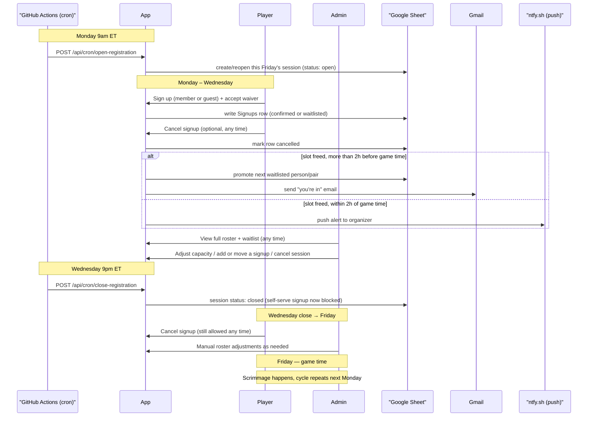

# Weekly Softball Scrimmage

The signup app for New Hope Fellowship's weekly pickup softball game.
Members and their guests sign in with Google, sign up for a spot
(first-come first-served with an automatic waitlist), see whether
they're confirmed or waitlisted, and cancel if plans change — with
promotions and organizer alerts handled automatically. A Next.js app
backed by a Google Sheet as its database.

## How it fits together

- **Next.js app** (`src/app`) — the signup UI, the admin dashboard, and
  every API route. Deployed on Vercel.
- **Google Sheet** (`src/sheets`) — the database. Four tabs: `Sessions`
  (one row per Friday), `Signups`, `Players` (saved profiles), `Admins`
  (allowlist of admin emails). Read and written via a service account
  through the Sheets API, not a spreadsheet UI a player ever touches
  directly.
- **Google OAuth** (`next-auth`) — player identity. A signed-in Google
  account's email is the identity used everywhere (no separate
  username/password).
- **Gmail API** — sends the one automated email the app ever sends: "you
  moved up from the waitlist." Authorized once against a dedicated
  dedicated Gmail account (`scripts/authorizeGmailSender.ts`), not per
  player.
- **ntfy.sh** — a push notification to the organizer for a cancellation
  too close to game time to auto-promote anyone.
- **GitHub Actions** (`.github/workflows`) — the only two scheduled
  jobs: opening and closing registration each week, on a cron.

## Typical week



### As a player

1. **Monday, 9am ET** — registration opens automatically for that
   week's Friday game. No action needed to make this happen; it's just
   when the app starts accepting signups.
2. **Sign up any time before Wednesday 9pm ET.** First-time players fill
   out a short profile (name, gender, age, positions) once — after that
   it's remembered. Every signup requires accepting the waiver, every
   time. You can sign up for yourself, or bring a guest (who answers two
   extra questions: who invited them, and whether they're willing to
   share a slot with that member rather than take a separate spot).
3. **You're told immediately** whether you're confirmed or on the
   waitlist, based on the week's capacity.
4. **Cancel any time** if plans change — from right after you sign up
   through game day itself. If your cancellation frees up a confirmed
   spot:
   - More than 2 hours before game time: the next person (or pair) on
     the waitlist is automatically promoted and emailed.
   - Within 2 hours of game time: no one is auto-promoted (too last
     minute for an email to reach anyone in time) — the organizer gets a
     push alert instead so they can personally text someone.
5. **Wednesday, 9pm ET** — registration closes automatically. You can no
   longer sign up fresh for that week, but you can still cancel an
   existing signup.
6. **Friday** — game time, whatever the session's configured time is
   (6pm ET by default).

### As an admin

Anyone whose email is on the `Admins` sheet tab sees an admin dashboard
in addition to the regular player view. Across the same week:

- **View the full roster and waitlist** at any time — unlike the
  player-facing view, this shows every signup regardless of status
  (including cancelled ones), for the complete picture.
- **Adjust that week's capacity**, or **cancel the whole session** (e.g.
  a rainout) — cancelling the session doesn't bulk-cancel existing
  signups, so there's a record of who would've played if it gets
  rescheduled.
- **Manually add a signup** on someone's behalf — same member/guest
  logic and capacity accounting a player's own signup goes through, for
  someone who texted the organizer directly instead of using the app.
- **Manually move someone's status** (confirmed / waitlisted /
  cancelled) or remove a signup entirely — a direct override that
  deliberately skips the automatic promotion/email side effects, since a
  manual admin action already is the explicit decision.
- Gets the **late-cancellation push alert** described above whenever
  anyone cancels within 2 hours of game time.

## Setup

```sh
npm install
```

You need:

1. A **Google Cloud project** with the Sheets API and Gmail API enabled,
   an OAuth client (for player login), and a service account with
   **Editor** access to the target spreadsheet.
2. The service account's JSON key saved at
   `credentials/service-account.json` (gitignored — never commit this;
   in production it's supplied via the `GOOGLE_SERVICE_ACCOUNT_KEY` env
   var instead, see `src/sheets/client.ts`).
3. A `.env.local` with (see each module for exactly how it's used):
   `GOOGLE_CLIENT_ID`, `GOOGLE_CLIENT_SECRET`, `NEXTAUTH_SECRET`,
   `NEXTAUTH_URL`, `GMAIL_SENDER_EMAIL`, `GMAIL_SENDER_REFRESH_TOKEN`,
   `ORGANIZER_ALERT_NTFY_TOPIC`, `CRON_SECRET`.
4. The Sheet shared with the service account's
   `...@...iam.gserviceaccount.com` email as an **Editor**.

```sh
npm run dev              # local dev server
npm run setup:sheets     # create the Sessions/Signups/Players/Admins tabs
npm run authorize-gmail-sender  # one-time OAuth flow for the sender account
```

## Scripts

| Command | What it does |
|---|---|
| `npm run dev` | Local dev server (Turbopack). |
| `npm run build` / `npm start` | Production build / run. |
| `npm run lint` | ESLint. |
| `npm run setup:sheets` | Creates the four data tabs with headers, if they don't already exist. |
| `npm run authorize-gmail-sender` | One-time OAuth flow that prints a refresh token for `GMAIL_SENDER_REFRESH_TOKEN` — see `scripts/authorizeGmailSender.ts`. |

`scripts/seedDummyData.ts` seeds a throwaway test session and signups
(`@dummy.test` emails) through the real signup flow, for exercising the
app end-to-end without real players.

## Notes

- `credentials/` and `.env*.local` are gitignored — never commit a
  service account key or a refresh token.
- See `planner/PROJECT_GUIDELINES.md` for the original spec this app was
  built against, and `planner/*.md` for the implementation history.
